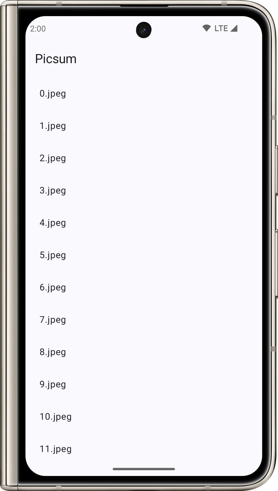
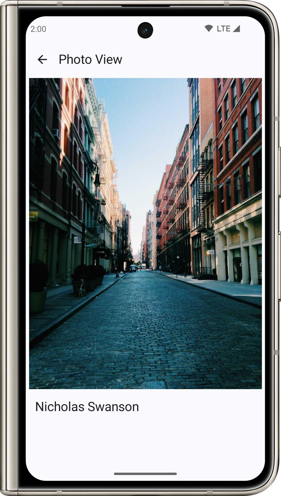
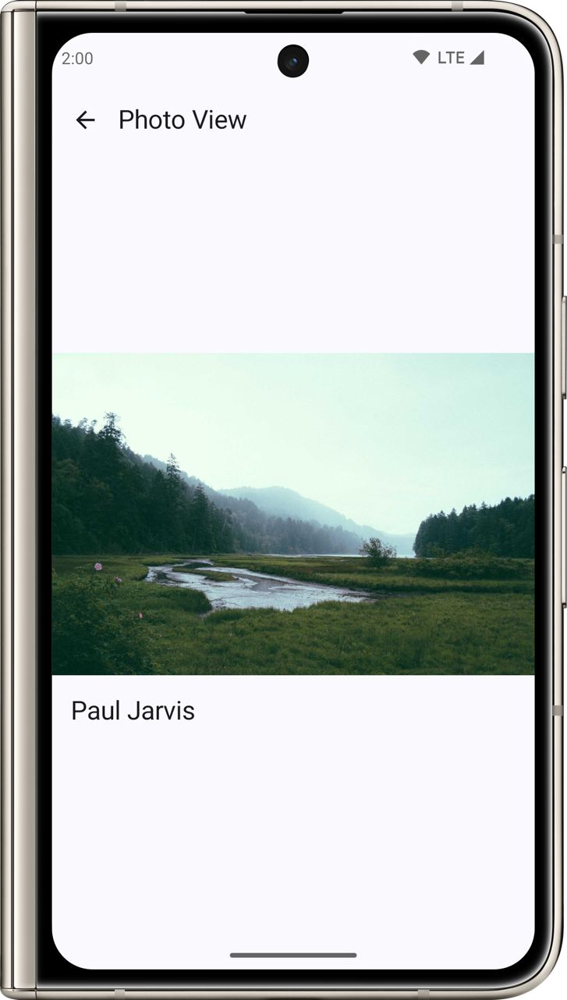
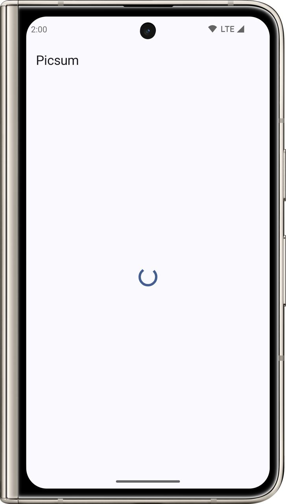
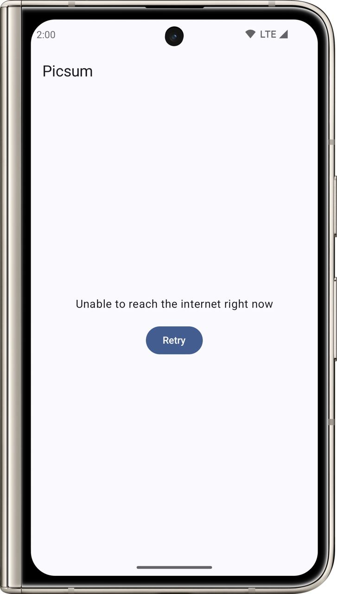
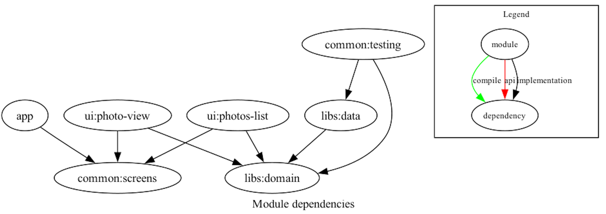

# Picsum App 🖼️

## Overview 🌐

Picsum is an Android application that not only showcases the integration of contemporary technologies and best practices in app development as of March 2024 but also exemplifies the meticulous application of Clean Code principles and SOLID design. By adhering to these methodologies, the Picsum app ensures code quality, maintainability, and scalability. It features a clean and intuitive interface built with Jetpack Compose, providing users access to a vast collection of images sourced from the Picsum Photos API.
## Technologies and Architectures 🏗️

- **Programming Language:** Kotlin 1.9.22
- **Architecture:** Unidirectional Data Flow (UDF) using Slack's Circuit library
- **UI Toolkit:** Jetpack Compose with Material3
- **Architecture Layers:** Data, Domain, UI (`photos-list`, `photo-view`)
- **Image Loading:** Coil for efficient and fast image handling
- **Networking:** Retrofit with Moshi for seamless API communication
- **Asynchronous Programming:** Coroutines and Kotlin Flows for a smooth, asynchronous user experience
- **Dependency Injection:** Dagger Hilt for scalable and manageable dependency management
- **Testing:** JUnit, Roborazzi, Turbine, MockWebServer, and assertK for a comprehensive testing suite
- **Static Code Analysis:** Spotless to ensure code quality
- **Code Generation:** Kotlin Symbol Processing (KSP) for efficient boilerplate reduction
- **Build System:** Gradle with convention plugins for streamlined builds
- **IDE:** Android Studio Jellyfish | 2023.3.1 Canary 13 for cutting-edge development features

## Features 🌟

- **Image List View:** Users are greeted with a sleek list of images. The app smartly handles the lack of thumbnails by using the full images with proper loading mechanisms to ensure a seamless user experience.
- **Detail View:** Tapping on an image in the list brings up a detailed view with the image displayed in full width, complemented by the author's name.
- **Adaptive Layout:** The app dynamically adjusts the display for landscape and portrait images, ensuring an aesthetically pleasing experience.
- **Optimized for Mobile:** Designed specifically for mobile devices, the Picsum app provides an exceptional experience in portrait orientation.
- **Robust Testing:** A full suite of tests guarantees reliability and a bug-free experience for users.

## Screenshots 📸

Here are various screenshots demonstrating the app's functionality and UI states:

  
  
  
  
  

## Project Modules 📚

The Picsum app is divided into several modules, with `common:screens` and `libs:domain` being pure Kotlin modules, reflecting an emphasis on Kotlin's strengths in terms of clean and efficient code for cross-cutting concerns:

- `app` - The core application module and entry point.
- `ui:photo-view` - Manages the UI for displaying full image details.
- `ui:photos-list` - Controls the UI for listing images from the API.
- `common:screens` - Shared UI components (pure Kotlin).
- `libs:data` - Encapsulates all data handling, including API interactions.
- `libs:domain` - Contains the business logic and domain-specific use cases (pure Kotlin).
- `common:testing` - Provides utilities and configurations for testing various app components.

The modular design is captured in the following module dependency graph:

## Contribution and Workflow Strategy

For the initial development phase and to save time, all code has been directly pushed to the `main` branch of this repository. However, in a typical team scenario, I adhere to a pull request (PR) based workflow. Each new feature, fix, or improvement is worked on in a separate branch and then merged into `main` via a pull request, allowing for code review and discussion.

For an example of how a PR process looks, check out this merged [PR #1](https://github.com/LloydBlv/Picsum/pull/1).

This workflow ensures maintainability and quality of code when working collaboratively in a team environment, and is a practice I strongly advocate for scalable and professional development.

## Setup and Running 📲

### Prerequisites

- Android Studio Jellyfish | 2023.3.1 Canary 13
- JDK 17

### Steps

1. Clone the repository to your local machine.
2. Open the project in Android Studio Jellyfish | 2023.3.1 Canary 13.
3. Synchronize Gradle files and confirm compatibility with the project settings.
4. Build the project with `Build -> Make Project`.
5. Run the app on an Android device or emulator using `Run -> Run 'app'`.
